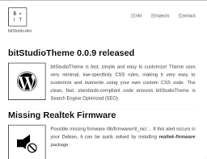

## bitStudioTheme for Wordpress

Contributors: [Wojciech Bobrowski](https://bitstudio.dev) \
Requires at least: 4.0 \
Tested up to: 5.2 \
Stable tag: 1.0.0 (NOT YET) \
License: GPLv3 or later \
License URI: https://www.gnu.org/licenses/gpl-3.0.html \
GitHub Theme URI: https://github.com/bitStudioDev/bitStudioTheme \
Tags: one-column, custom-menu, editor-style, featured-images, full-width-template, threaded-comments, translation-ready, blog

A starter theme called bitStudioTheme.

bitStudioTheme WordPress Theme, Copyright 2019 Wojciech Bobrowski
bitStudioTheme is distributed under the terms of the GNU GPL

### Description

bitStudioTheme is fast, simple and easy to customize!

bitStudioTheme uses very minimal, low-specificity CSS rules, making it very easy to customize and overwrite using your own custom CSS code.

The clean, fast, standards-compliant code ensures bitStudioTheme is Search Engine Optimized (SEO).

### Installation

1. In your admin panel, go to Appearance > Themes and click the Add New button.
2. Click Upload and Choose File, then select the theme's .zip file. Click Install Now.
3. Click Activate to use your new theme right away.
